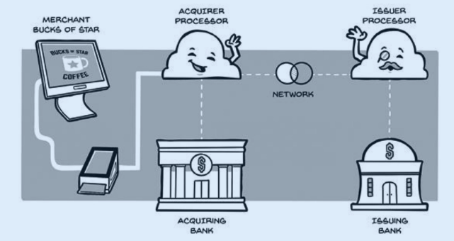

# SwipeLab

SwipeLab is an educational payment processing system built to explore how a card payment travels from a merchant to an issuing bank.

The project is inspired by *The Anatomy of the Swipe* by Ahmed Siddiqui and focuses on implementing payment infrastructure concepts rather than integrating with a real card network.

## Architecture



*Diagram from The Anatomy of the Swipe by Ahmed Siddiqui.*

```text
POS / Merchant
      |
      v
Acquirer Processor (Go, :8081)
      |
      v
Card Network (Go, :8082)
      |
      v
Issuer Processor (Java / Spring Boot, :8083)
```

Each component is implemented as an independent service and communicates over HTTP rather than importing code from other services.

The end-to-end authorization request flow is operational. Authorization decisions and response propagation are still under development.

## Services


### Acquirer Processor

**Language:** Go  
**Database:** PostgreSQL

The acquirer receives payment authorization requests from merchants, persists authorization transactions, and forwards requests to the Card Network.

**Currently implemented:**

- `POST /authorizations`
- Authorization request validation
- Merchant validation
- Authorization transaction creation
- PostgreSQL persistence
- UUID transaction identifiers
- Authorization status tracking
- Idempotency key support
- Duplicate authorization prevention for sequential retries
- Concurrency-safe idempotency
- Idempotency request fingerprint validation
- Card Network authorization forwarding
- Authorization failure status updates (`PENDING` → `FAILED`)
- Network rejection handling
- Uncertain authorization outcome handling (retains `PENDING` on network errors)

**Planned:**

- Issuer authorization response handling (`APPROVED` / `DECLINED`)
- Final authorization status persistence
- Timeouts and retries
- Capture
- Reversals
- Clearing and settlement
- Reconciliation
- Automated tests


### Card Network

**Language:** Go

The Card Network routes authorization requests between the Acquirer Processor and the appropriate Issuer Processor based on the card number prefix.

**Currently implemented:**

- `POST /authorizations`
- Incoming authorization request validation
- Issuer identification using card number prefixes
- Issuer routing configuration
- HTTP authorization forwarding to the Issuer Processor
- Issuer communication error handling
- Authorization ID propagation across services

**Planned:**

- Processing issuer approval and decline responses
- Forwarding authorization decisions to the Acquirer Processor
- Improved timeout and retry handling
- Additional issuer routing scenarios
- Automated tests


### Issuer Processor

**Language:** Java 21  
**Framework:** Spring Boot  
**Build Tool:** Maven

The Issuer Processor simulates the cardholder's bank. It receives authorization requests from the Card Network and will eventually decide whether to approve or decline a transaction.

**Currently implemented:**

- Spring Boot application setup
- `POST /authorizations`
- Authorization request DTO
- JSON request deserialization
- HTTP integration with the Card Network
- Authorization receipt logging using the transaction ID
- Successful HTTP acknowledgement of incoming requests

**Planned:**

- Authorization response DTO
- Authorization business logic
- Approval and decline decisions
- Card and account validation
- Account balance management
- Authorization holds
- PostgreSQL persistence
- Automated tests


## Authorization Flow

An authorization represents a request to approve a payment.

The current implementation supports the following request flow:

```text
Merchant
   |
   | Authorization request
   | 2500 HUF
   v
Acquirer Processor
   |
   | Creates authorization
   | Status: PENDING
   v
Card Network
   |
   | Identifies issuer
   | Forwards request
   v
Issuer Processor
   |
   | Receives authorization
   | Returns HTTP 200
   v
Card Network
   |
   v
Acquirer Processor
   |
   | Status remains PENDING
   v
Merchant
```

The Issuer currently acknowledges incoming authorization requests without making an approval or decline decision.

**Planned authorization decision flow:**

```text
Issuer Processor
       |
       v
Authorization validation
       |
       v
Authorization decision
     /     \
    v       v
APPROVED  DECLINED
    \       /
     v     v
   Card Network
       |
       v
Acquirer Processor
       |
       v
Update authorization status
```

Authorization decisions will eventually propagate back through the Card Network to the Acquirer, where the final status will be persisted.

## Running SwipeLab


### Prerequisites

- Go
- Java 21
- Docker and Docker Compose
- Maven Wrapper (included in the Issuer project)


### 1. Start PostgreSQL

From the repository root:

```bash
docker compose up -d acquirer-db
```

Ensure the Acquirer's database migrations have been applied.

### 2. Start the Acquirer Processor

```bash
cd acquirer
go run ./cmd/acquirer
```

The Acquirer runs on `http://localhost:8081`.

### 3. Start the Card Network

In another terminal:

```bash
cd network
go run ./cmd/network
```

The Card Network runs on `http://localhost:8082`.

### 4. Start the Issuer Processor

In another terminal:

```bash
cd issuer
./mvnw spring-boot:run
```

The Issuer runs on `http://localhost:8083`.

All three services must be running to test the complete authorization request flow.

## Example Authorization

Send an authorization request to the Acquirer Processor:

```bash
curl -i -X POST http://localhost:8081/authorizations \
  -H "Content-Type: application/json" \
  -H "Idempotency-Key: example-auth-001" \
  -d '{
    "merchant_id": "MERCHANT_001",
    "card_number": "4111111111111111",
    "amount": 2500,
    "currency": "HUF"
  }'
```

The card number is simulated test data.

**Example response:**

```json
{
  "id": "550e8400-e29b-41d4-a716-446655440000",
  "merchant_id": "MERCHANT_001",
  "amount": 2500,
  "currency": "HUF",
  "status": "PENDING",
  "created_at": "2026-10-08T19:54:06Z"
}
```

**Expected behavior:**

1. The Acquirer validates the request and creates an authorization.
2. The authorization is stored in PostgreSQL with status `PENDING`.
3. The Acquirer forwards the request to the Card Network.
4. The Card Network identifies the issuer using the card number prefix.
5. The Card Network forwards the authorization to the Issuer Processor.
6. The Issuer acknowledges the request with HTTP 200.
7. The Acquirer returns the authorization with status `PENDING`.

The same authorization UUID is used throughout the request flow.

**Note:** A successful HTTP response from the Issuer currently indicates successful receipt, not payment approval.

## Money Representation

Amounts are stored as integers rather than floating-point numbers.

For currencies with two decimal minor units:

```text
€25.99 → 2599
$25.99 → 2599
```

Currency-specific minor-unit rules will be handled explicitly by the payment system.

## Roadmap

- [x] Acquirer authorization endpoint
- [x] PostgreSQL authorization persistence
- [x] Merchant validation
- [x] Idempotency and concurrency-safe duplicate prevention
- [x] Acquirer-to-Network communication
- [x] Card Network issuer routing
- [x] Java / Spring Boot Issuer Processor setup
- [x] Network-to-Issuer HTTP communication
- [x] End-to-end authorization request forwarding
- [ ] Issuer approval and decline decisions
- [ ] Authorization response propagation
- [ ] Final authorization status persistence
- [ ] Issuer account balances and authorization holds
- [ ] Timeout and retry improvements
- [ ] Capture and reversals
- [ ] Clearing and settlement
- [ ] Reconciliation
- [ ] Automated tests


## Purpose

SwipeLab is not intended to process real card payments.

It is a learning project for exploring concepts such as:

- Payment authorization
- Acquiring and issuing
- Card-network routing
- Idempotency
- Concurrency
- Database transactions
- Timeouts and retries
- Reversals
- Clearing
- Settlement
- Reconciliation

All payment data used by SwipeLab is simulated. Real payment card credentials must not be used.